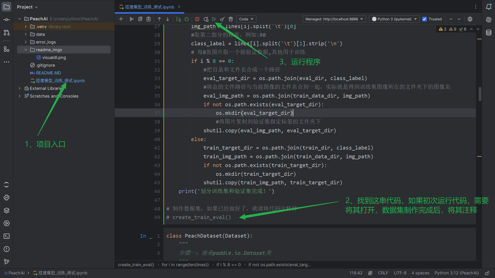
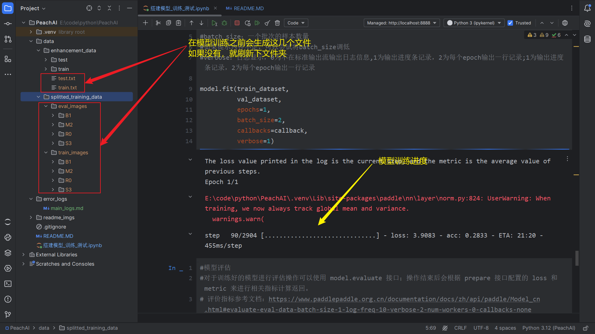
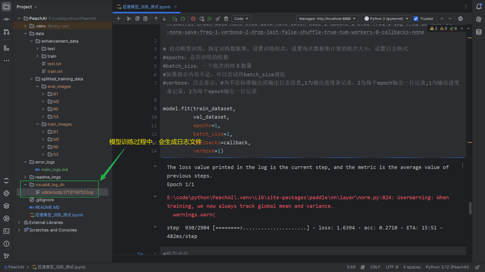

# 图像分类——桃子分拣项目
> [桃子分类模型原文地址](https://aistudio.baidu.com/projectdetail/7699500?forkThirdPart=1)

项目目录
```txt
     PeachAI
        |__ data
        |     |__ enhancement_data
        |     |          |__ test
        |     |               |__ ...
        |     |          |__ train
        |     |               |__ ...
        |     |__ splitted_training_data
        |                |__ ...
        |__ *.ipynb
```

## 项目运行


> 运行之后刷新下项目，会出现几个新的文件


